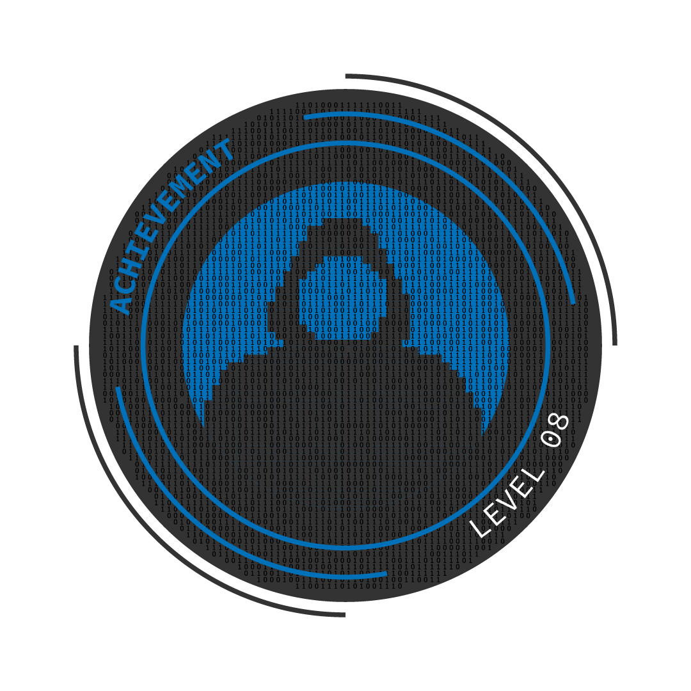

 

# 🔐 Vault Guardians Security Audit

A comprehensive security audit of the **Vault Guardians** ERC4626 yield vault protocol.

**Lead Security Researcher:** [GushALKDev](https://github.com/GushALKDev)

---

## 🎯 Personal Milestone

> **This is my first independent security audit** 🎉

After completing all the lessons from the **Cyfrin Security Course** and working through guided audits led by **Patrick Collins**, this audit represents a major milestone in my journey as a Smart Contract Security Researcher.

I have invested significant time and effort into this audit, applying everything I've learned throughout the course:
- **Manual code review** following systematic checklist approaches
- **Static analysis** with Slither and Aderyn
- **Fuzz testing** and **Fork testing** on mainnet
- **Invariant testing** to verify protocol assumptions
- **Attack vector identification** including MEV, reentrancy, and governance attacks

I am extremely proud to have successfully completed this audit independently. The Vault Guardians protocol presented complex challenges involving ERC4626 accounting, DeFi integrations (Aave V3, Uniswap V2), and governance mechanics, all of which required deep understanding to properly analyze.

This audit marks the beginning of my career as a security researcher, and I look forward to continuing to grow in this field.

---

## 📋 Table of Contents

- [Personal Milestone](#-personal-milestone)
- [Audit Overview](#audit-overview)
- [📄 Full Audit Report (PDF)](#-full-audit-report-pdf)
- [Severity Classification](#severity-classification)
- [Executive Summary](#executive-summary)
- [Findings](#findings)
  - [High Severity](#-high-severity)
  - [Medium Severity](#-medium-severity)
  - [Low Severity](#-low-severity)
  - [Informational](#-informational)
  - [Gas Optimizations](#-gas-optimizations)
- [Tools Used](#-tools-used)
- [Lessons Learned](#-lessons-learned)
- [Section 8: The NFT Achievement](#-section-8-the-nft-achievement)

---

## Audit Overview

| Item | Detail |
|------|--------|
| **Audit Commit Hash** | `e07540037ef1dd89e2e27b090fc21f7aa6e51c4f` |
| **Solidity Version** | `0.8.20` |
| **Target Chain** | Ethereum |
| **Scope** | `src/protocol/`, `src/dao/`, `src/abstract/`, `src/interfaces/` |
| **Methods** | Manual Review, Static Analysis (Slither, Aderyn), Fuzz Testing, Fork Testing |

---

## 📄 Full Audit Report (PDF)

> **[📥 Download the Complete Audit Report (PDF)](./audit-data/report.pdf)**

The full report contains detailed findings with complete Proof of Concept code, diff patches, and comprehensive recommendations.

---

## Severity Classification

| Severity | Impact |
|----------|--------|
| 🔴 **High** | Critical vulnerabilities leading to direct loss of funds or complete compromise |
| 🟠 **Medium** | Issues causing unexpected behavior or moderate financial impact |
| 🟡 **Low** | Minor issues that don't directly risk funds |
| 🔵 **Info** | Best practices and code quality improvements |
| ⚡ **Gas** | Gas optimization opportunities |

---

## Executive Summary

The **Vault Guardians** protocol contains **critical security vulnerabilities** that make it **unsafe for production deployment**. The most severe issues are in the ERC4626 implementation, DeFi integrations, and governance token mechanics.

### Key Metrics

| Severity | Count |
|----------|-------|
| 🔴 High | 14 |
| 🟠 Medium | 5 |
| 🟡 Low | 7 |
| 🔵 Info | 9 |
| ⚡ Gas | 3 |
| **Total** | **38** |

### Critical Risks

- ⚠️ **Free Share Minting** - Missing `mint()` override allows attackers to mint shares for ~0 cost when funds are invested.
- ⚠️ **DAO Takeover** - Guardians can farm unlimited VGT tokens by repeatedly becoming/quitting guardian.
- ⚠️ **Broken Uniswap Operations** - Missing LP token approvals cause all divest operations to revert.
- ⚠️ **WETH Vault DoS** - Pair calculation returns address(0) for WETH vaults, breaking all operations.
- ⚠️ **Sandwich Attack Exposure** - `amountOutMin=0` in all Uniswap swaps enables MEV extraction.

---

## Findings

### 🔴 High Severity

| ID | Finding |
|----|---------|
| H-1 | Missing Override of `mint()` Enables Free Share Minting and Vault Draining |
| H-2 | Guardians Can Infinitely Mint VaultGuardianTokens and Take Over DAO |
| H-3 | Missing LP Token Approval Breaks Uniswap Divest Operations |
| H-4 | WETH Vault Pair Calculation Returns `address(0)`, Breaking Core Functions |
| H-5 | Missing Zero Check for Allocations Causes Aave Revert |
| H-6 | Lack of Slippage Protection (`amountOutMin=0`) Enables Sandwich Attacks |
| H-7 | Guardian Cannot Quit Due to Missing Allowance for Redemption |
| H-8 | ETH Fees Permanently Locked in Contract |
| H-9 | `GUARDIAN_FEE` Is Not Collected in `becomeGuardian()` |
| H-10 | `s_guardianStakePrice` Scaling Issue Causes DoS for Low-Decimal Tokens (USDC) |
| H-11 | Overwriting Active Vaults Locks Funds |
| H-12 | `amountADesired` Double-Counting Can Cause `addLiquidity` to Revert |
| H-13 | Deleting Guardian Mapping Orphans Vault |
| H-14 | Users Immediate Dilution on Deposit |

---

### 🟠 Medium Severity

| ID | Finding |
|----|---------|
| M-1 | `votingDelay()` and `votingPeriod()` Return Seconds Instead of Blocks |
| M-2 | Using `block.timestamp` for Deadline Offers No MEV Protection |
| M-3 | Weird ERC20 Tokens May Cause `approve()` to Fail |
| M-4 | Missing Validation for `newCut` Can Cause DoS |
| M-5 | Updating Allocation Without Rebalancing Creates Discrepancy |

---

### 🟡 Low Severity

| ID | Finding |
|----|---------|
| L-1 | Incorrect Vault Name and Symbol for `i_tokenTwo` (LINK) |
| L-2 | Missing Return Value Assignment in `_aaveDivest()` |
| L-3 | Wrong Error Name in `quitGuardian()` |
| L-4 | `nonReentrant` Modifier Should Be First |
| L-5 | Events Emitted After State Changes |
| L-6 | Missing Events in Critical Functions |
| L-7 | Event Emits Updated Value Instead of Old Value |

---

### 🔵 Informational

| ID | Finding |
|----|---------|
| I-1 | Unused Interfaces and Custom Errors Should Be Removed |
| I-2 | Centralization Risks |
| I-3 | Multiple Typos in Function Names and Event Names |
| I-4 | Missing NatSpec Documentation |
| I-5 | Test Coverage Should Be Improved |
| I-6 | Incompatibility with Fee-on-Transfer Tokens |
| I-7 | Missing `indexed` Parameters in Events |
| I-8 | Solidity 0.8.20 May Not Be Compatible With All L2 Networks |
| I-9 | Missing Zero Amount Checks |

---

### ⚡ Gas Optimizations

| ID | Finding |
|----|---------|
| G-1 | Functions Could Be Marked `external` |
| G-2 | Modifiers Can Be Wrapped in Internal Functions |
| G-3 | Cache State Variables in Loops |

---

## 🛠 Tools Used

| Tool | Purpose |
|------|---------|
| [Foundry](https://github.com/foundry-rs/foundry) | Testing, Fuzz testing & Fork testing |
| [Slither](https://github.com/crytic/slither) | Static analysis |
| [Aderyn](https://github.com/Cyfrin/aderyn) | Smart contract analyzer |
| Manual Review | Systematic code review with checklist |

---

## 📚 Lessons Learned

1. **ERC4626 Override Completeness** - When extending ERC4626, ensure ALL entry points (`deposit`, `mint`, `withdraw`, `redeem`) are properly overridden if custom logic is needed. The `mint()` oversight was the root cause of the most critical vulnerability.

2. **`totalAssets()` Accuracy** - For yield vaults that invest funds externally, `totalAssets()` must account for invested amounts, not just local balance. This is fundamental for correct share/asset calculations.

3. **Governance Token Economics** - Tokens minted to users should be burned when they exit, or use vesting schedules. Otherwise, infinite minting attacks become trivial.

4. **DeFi Integration Testing** - Always test integrations against real protocols (Aave, Uniswap) via fork testing. Mock contracts often hide critical issues like approval requirements.

5. **Slippage Protection** - Never use `amountOutMin=0` or `deadline=block.timestamp` in production. These are the most common MEV attack vectors.

6. **Access Control in Vault Redemptions** - When a contract redeems on behalf of users, ensure proper allowance handling or implement explicit bypass mechanisms.

7. **Systematic Approach** - Using a structured methodology (Manual → Static Analysis → Fuzz → Fork testing) ensures comprehensive coverage and catches issues that single tools miss.

---

## 🏆 Section 8: The NFT Achievement

### 🎮 The Challenge

As part of the **Cyfrin Security Course**, Section 8 presented the ultimate test: **complete a full independent security audit of the Vault Guardians protocol**. Unlike previous sections where challenges could be solved with specific exploits or code snippets, this section required:

- A comprehensive security review of the entire codebase
- Identification of all vulnerability classes (High, Medium, Low, Info, Gas)
- Professional-quality audit report with PoCs and mitigations
- Deep understanding of ERC4626, Aave V3, and Uniswap V2 integrations

### ✅ Challenge Completed

By successfully completing this audit with **38 findings** (including 14 High severity), I have earned the **Section 8 Achievement NFT**, marking the completion of all practical challenges in the Cyfrin Security Course.

This NFT represents not just technical knowledge, but the ability to apply security concepts independently on real-world protocol architectures.

---

## 🙏 Acknowledgments

Special thanks to:
- **Patrick Collins** and the **Cyfrin** team for the incredible Security Course
- All the Web3 security researchers sharing knowledge

---

Made with ❤️ by **GushALKDev** | First Independent Security Audit Completed 🎉

